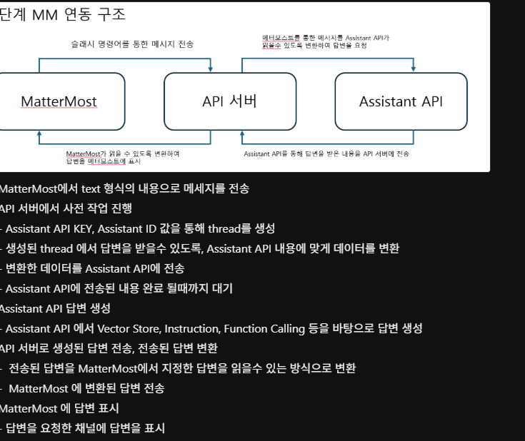
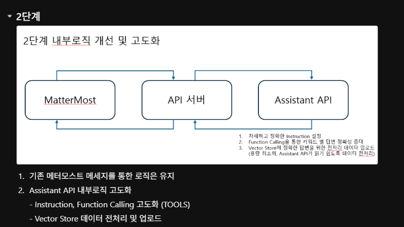
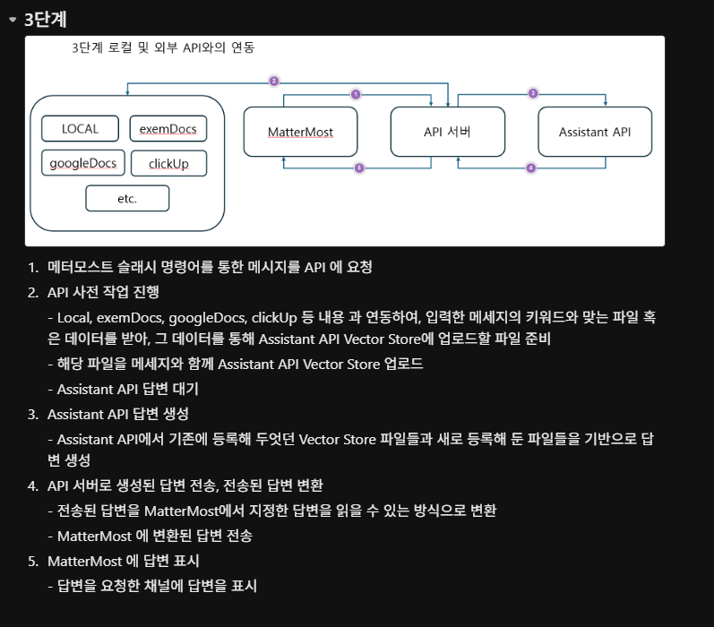

# BotServer - Mattermost and LLM Assistant Chatbot

> A sample integration server that connects Mattermost slash commands to an LLM Assistant.
> The project focuses not only on chatbot response flow, but also on the QA question of how wrong answers should be handled.

## Data Disclaimer

All slash command names, routing keywords, database connection examples, SQL examples, and logs in this repository are sample values. They are not copied from any current or former company or customer environment.

Virtualized examples include:

- Slash command names such as `/sample-bot`
- Routing keywords such as `topic_a` and `topic_b`
- Database host, table, and query examples
- Assistant routing examples

## Problem

QA and operations channels often repeat the same questions:

- What was the build number for this environment?
- What caused the incident last week?
- Where is the performance test procedure documented?

This project reduces repeated human answers while keeping the response flow explicit and testable.

## Approach

| Decision | Reason |
| --- | --- |
| Mattermost slash command and outgoing webhook | Uses a familiar collaboration interface |
| OpenAI Assistant API | Maintains thread-based conversation context |
| Keyword-based assistant routing | Keeps topic-specific assistants separated |
| Background processing | Avoids blocking chat UX while waiting for the LLM |
| `.env` configuration | Keeps API keys and tokens out of source code |

## Main Features

| Feature | Description |
| --- | --- |
| Async response flow | Returns an immediate processing message, then posts the final answer later |
| User thread reuse | Reuses an OpenAI thread by Mattermost user ID |
| Conversation reset | Supports `reset` to clear a user's local thread mapping |
| Multi-assistant routing | Routes messages to assistant IDs by keyword |
| Timeout handling | Returns a controlled error message after the configured timeout |
| Citation cleanup | Removes Assistant citation markers from final text |
| Token validation | Optionally validates Mattermost webhook token |
| Structured logging | Logs to console and `botserver.log` |

## Message Flow

```text
Mattermost user
  -> POST /sample-bot
  -> immediate ephemeral response
  -> background thread processing
  -> OpenAI Assistant run polling
  -> citation cleanup
  -> response_url final POST
```

## Architecture Phases

The diagrams below summarize the integration path from the initial Mattermost slash command flow to the expanded connector-based assistant flow.

### Phase 1 - Mattermost Integration



### Phase 2 - Assistant Logic



### Phase 3 - Connector Expansion



## Quick Start

```bash
pip install -r requirements.txt
cp .env.example .env
python app.py
```

The server starts on `0.0.0.0:5000` by default.

## Environment Variables

| Variable | Required | Default | Description |
| --- | --- | --- | --- |
| `OPENAI_API_KEY` | Yes | - | OpenAI API key |
| `ASSISTANT_ID` | Yes | - | Default Assistant ID |
| `MATTERMOST_TOKEN` | No | Empty | Mattermost webhook token |
| `PORT` | No | `5000` | Server port |
| `POLL_TIMEOUT` | No | `120` | Maximum wait time in seconds |
| `POLL_INTERVAL` | No | `5` | Poll interval in seconds |
| `ASSISTANT_ROUTES` | No | `{}` | JSON keyword to Assistant ID map |

Example routing configuration:

```text
ASSISTANT_ROUTES={"topic_a":"asst_aaa","topic_b":"asst_bbb"}
```

## API Endpoints

| Method | Path | Description |
| --- | --- | --- |
| `GET` | `/health` | Health check |
| `GET` | `/thread` | Creates a new OpenAI thread |
| `POST` | `/sample-bot` | Receives Mattermost slash command requests |
| `GET` | `/apidocs` | Swagger UI |

## Database Utility Note

`insert.py` is a learning-oriented PostgreSQL performance test data generator. Any remaining connection values should be replaced with local dummy values before use.

## QA Meaning And Limits

This repository demonstrates the integration pattern, not a production-ready support bot. It does not evaluate answer correctness by itself. The next QA question is how to detect and measure a chatbot's wrong answers, which is handled by the sibling `aiops-sentinel` project through LLM output evaluation.

## Roadmap

- Persist conversation context in Redis or a database
- Add response quality evaluation with `aiops-sentinel`
- Add response time and failure-rate monitoring
